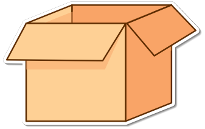

# Timebox 

    

Timebox is a small, opinionated event sourcing library for Go backed by Redis or Valkey. It provides an append-only event log, optimistic concurrency, snapshotting, and an in-process event hub so multiple instances can coordinate through the same store.

## Features

- **Complete event sourcing** with immutable event log and sequence-based versioning
- **Optimistic concurrency** with automatic retries on conflicts
- **Snapshots and caching** with background workers and LRU projection cache
- **Distributed coordination** through a shared Redis/Valkey backend
- **Type-safe generics**: no interfaces to implement in your domain types
- **EventHub**: push events to in-process consumers while persisting to Redis

## Core Concepts

- **Timebox**: Root object that owns configuration, lifecycle, and the EventHub.
- **Store**: Redis-backed persistence for events and snapshots; publishes appended events to the hub.
- **Executor/Aggregator/Command**: Executor loads state (from cache/snapshot/log), runs your command, and persists events raised on the Aggregator with optimistic retries.
- **Appliers**: Pure functions that fold an event into aggregate state. `MakeApplier` lets you work with strongly typed payloads.
- **Handlers/Dispatchers**: Helpers for consuming events from the EventHub without manual JSON decoding.
- **Snapshots**: Created automatically as events grow; also available on demand with `SaveSnapshot`.

## Examples

- `examples/order.go` is a runnable order lifecycle that shows how appliers, commands, and event consumption fit together.

## Status

Work in progress. Not ready for production use.
