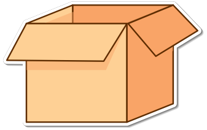

# Timebox 

 [](https://qlty.sh/gh/kode4food/projects/timebox) [](https://qlty.sh/gh/kode4food/projects/timebox) [](https://github.com/kode4food/timebox/blob/main/LICENSE.md)

Timebox is a small, opinionated event sourcing library for Go backed by Redis or Valkey. It provides an append-only event log, optimistic concurrency, snapshotting, and append-time indexing so multiple instances can coordinate through the same store.

## Features

- **Complete event sourcing** with immutable event log and sequence-based versioning
- **Optimistic concurrency** with automatic retries on conflicts
- **Snapshots and caching** with background workers and LRU projection cache
- **Indexing** through append-time projections for status and labels
- **Distributed coordination** through a shared Redis/Valkey backend
- **Archiving**: atomically move aggregate snapshots + events into a Redis stream
- **Type-safe generics**: no interfaces to implement in your domain types
## Core Concepts

- **Store**: Redis-backed persistence for events and snapshots.
- **Indexer/Index**: Optional append-time projection hook that can update status and label indexes atomically with event persistence.
- **Executor/Aggregator/Command**: Executor loads state (from cache/snapshot/log), runs your command, and persists events raised on the Aggregator with optimistic retries.
- **Appliers**: Pure functions that fold an event into aggregate state. `MakeApplier` lets you work with strongly typed payloads.
- **Snapshots**: Created automatically as events grow; also available on demand with `SaveSnapshot`.

## Configuration

Timebox uses a single `Config` type.

- `NewStore(cfgs...)` applies each config on top of the defaults in order.

`Config` fields:

- `Redis`: Redis/Valkey-specific store settings.
- `Snapshot`: snapshot worker and event trimming settings.
- `MaxRetries`: optimistic concurrency retry limit. Must be greater than zero.
- `CacheSize`: executor projection cache size. Must be greater than zero.
- `Archiving`: enables `Store.Archive` and `Store.ConsumeArchive`.
- `Indexer`: optional function that derives index mutations from an appended event batch.

`RedisConfig` fields:

- `Addr`: Redis/Valkey host:port.
- `Password`: Redis/Valkey password (optional).
- `Prefix`: key prefix for all store data.
- `Shard`: optional Redis hash-tag value. When set, keys are written as `<prefix>:{<shard>}:...` so all store keys land in the same cluster slot.
- `DB`: Redis/Valkey database index.
- `JoinKey`: function used to encode aggregate IDs into Redis keys.
- `ParseKey`: function used to decode aggregate IDs from Redis keys.

`SnapshotConfig` fields:

- `Workers`: enables background snapshot workers.
- `WorkerCount`: number of background snapshot workers.
- `MaxQueueSize`: snapshot queue capacity.
- `SaveTimeout`: snapshot persistence timeout.
- `TrimEvents`: trims events up to the latest snapshot sequence when enabled.

## Indexing

`Config.Indexer` lets you derive index mutations from an appended event batch. These mutations are persisted atomically with the event append.

`Index` currently supports:

- `Status`: tracks the aggregate's current status and when it entered that status. Use `Store.ListAggregatesByStatus` or `Store.GetAggregateStatus` to read that index.
- `Labels`: tracks the aggregate's current label values. Empty values remove the label.

Label indexing maintains two read paths:

- `Store.ListLabelValues(ctx, label)`: returns the unique current values for a label.
- `Store.ListAggregatesByLabel(ctx, label, value)`: returns the aggregate IDs indexed under a label/value pair.

Label updates overwrite prior values for the same aggregate and label. Setting a label value to `""` removes that label from the aggregate and updates the index. Indexes are derived state and are only updated implicitly during append and archive operations.

The derived index keyspace lives under `idx:`:

```text
<prefix>
└── idx
    ├── status                       HASH
    │   └── <aggregate-id> => <status>
    ├── status:<status>             ZSET
    │   └── member: <aggregate-id>
    │   └── score: entered-at unix millis
    ├── labels:<aggregate-id>       HASH
    │   └── <label> => <value>
    ├── label:<label>               SET
    │   └── members: <value>
    └── label:<label>:<value>       SET
        └── members: <aggregate-id>
```

`labels` stores per-aggregate current label state. `label` stores the reverse lookup indexes used by `ListLabelValues` and `ListAggregatesByLabel`.

## Archiving

Archiving atomically moves an aggregate's snapshot and full event log into a Redis stream and clears the original keys. It is a one-way operation (no restore API).

Enable it per store with `Archiving`, then call `Store.Archive(ctx, id)`.

To consume archived records, call `Store.ConsumeArchive(ctx, handler)`, which blocks until work is available and processes a single record per call. For a timed wait, call `Store.PollArchive(ctx, timeout, handler)`. Processing is at-least-once, so handlers must be idempotent. Successful handling acknowledges and deletes the stream entry.

Stream, group, and consumer names are derived from the store prefix:

- stream: `<prefix>:archive`
- group: `<prefix>:archive:group`
- consumer: `<prefix>:archive:consumer`

## Examples

- `examples/order.go` is a runnable order lifecycle that shows how appliers and commands fit together.

## Status

Work in progress. Not ready for production use.
