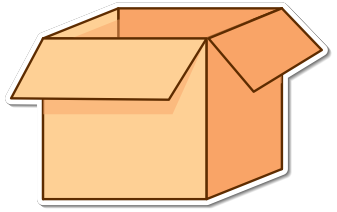

# Timebox 

 [](https://qlty.sh/gh/kode4food/projects/timebox) [](https://qlty.sh/gh/kode4food/projects/timebox) [](https://github.com/kode4food/timebox/blob/main/LICENSE)

Timebox is a small, opinionated event sourcing library for Go with pluggable persistence backends including memory, Redis/Valkey, PostgreSQL, and Raft. It provides an append-only event log, optimistic concurrency, snapshotting, and append-time indexing so multiple instances can coordinate through the same store.

## Backends

Timebox currently ships with:

- `memory` for tests and single-process use
- `redis` for Redis or Valkey deployments
- `postgres` for PostgreSQL-backed persistence
- `raft` for multi-node consensus

## Core Concepts

- `Store`: event-store semantics over a `Persistence`
- `AggregateID`: an aggregate's type and key, as in `("order", "123")`
- `Executor`: loads aggregate state, runs a command, persists raised events, and retries on optimistic conflicts
- `Transaction`: groups commands over several aggregates into one atomic append
- `Aggregator`: accumulates events and exposes the current aggregate view during a command
- `Indexer`: optional append-time hook that derives status and tag updates from an appended event batch
- `Snapshot`: cached aggregate state plus the sequence it represents

## Aggregate IDs

An `AggregateID` is a comparable struct of exactly two components, a `Type` and a `Key`, so it can be used as a map key directly and needs no canonicalization outside of the storage and wire boundaries:

```go
id := timebox.NewAggregateID("order", "ORD-12345")
catalog := timebox.NewAggregateType("catalog")
```

Callers supply both components. `NewAggregateType` builds the ID of an aggregate that is the only one of its type, such as a cluster or catalog aggregate, filling `Key` with `timebox.SingletonKey` (`"_"`).

Listing takes a type rather than an ID, since an aggregate ID always names one aggregate:

```go
orders, err := store.ListAggregates("order") // every order
all, err := store.ListAggregates("")         // every aggregate
```

Events marshal their IDs to JSON as a two-element array, so `("order", "123")` encodes as `["order","123"]`. Applications validate IDs at uncontrolled input boundaries, such as HTTP requests. Persistence codecs read IDs written by Timebox and do not enforce application input rules.

## Store Behavior

`timebox.Config` controls store behavior regardless of backend:

- `TrimEvents`: whether saving a snapshot trims older stored events
- `SnapshotRatio`: when an `Executor` should opportunistically refresh a snapshot while loading state
- `MaxRetries`: optimistic concurrency retry limit
- `CacheSize`: executor projection cache size
- `Indexer`: optional function that derives status and tag updates from an appended event batch

Pass backend settings and Timebox configuration to the backend's `NewStore` function:

```go
store, err := postgres.NewStore(postgres.Config{
	URL: "postgres://localhost:5432/postgres?sslmode=disable",
	Timebox: timebox.Config{
		MaxRetries: 8,
	},
})
```

For direct access to persistence, use `postgres.NewPersistence(cfg)` and then `timebox.NewStore(p)`. The store reads its Timebox configuration from `p.Config()`. Redis and Raft use the same construction pattern; memory accepts `timebox.Config` directly through `memory.NewStore(cfg)`.

Snapshotting is available in two ways:

- explicit saves through `Executor.SaveSnapshot(id)` or `Store.PutSnapshot(id, value, sequence)`
- opportunistic executor saves while loading aggregates when no snapshot exists yet or when trailing event data grows past `SnapshotRatio`

## Transactions

`Store.Transact` runs a function whose commands over any number of aggregates commit as a single atomic append. Every backend applies the whole batch or none of it, and each aggregate keeps its own optimistic concurrency check.

```go
err := store.Transact(func(t *timebox.Transaction) error {
	if _, err := t.Exec(orders, orderID, placeOrder); err != nil {
		return err
	}
	_, err := t.Exec(accounts, accountID, debitAccount)
	return err
})
```

- `Transaction.Exec(executor, id, cmd)` runs a command and enlists its events. Executors must belong to the same `Store`, otherwise it returns `ErrStoreMismatch`.
- Calling `Exec` again for an aggregate already joined continues the same `Aggregator`, so its later events append to the same staged batch. Joining one aggregate under two different state types returns `ErrAggregateTypeConflict`.
- Values returned from `Exec` only hold if the transaction commits.
- An error returned from the function discards the transaction. A version conflict on any aggregate re-runs the whole function, up to `MaxRetries`, then returns `ErrMaxRetriesExceeded`.
- Executor caches and `SuccessAction` callbacks run only after a successful commit.
- `Aggregator.Transaction()` returns the enclosing `Transaction`, so a command holding only an `Aggregator` can enlist further aggregates.

`Executor.Exec` is a single-aggregate transaction, so its behavior is unchanged.

## Backend Config

### Postgres

`postgres.Config` adds:

- `URL`: connection URL
- `Prefix`: logical store namespace
- `MaxConns`: pgx pool size cap

The Postgres backend stores:

- aggregate status and tags in backend-specific indexes
- snapshots in `timebox_snapshot`
- events in `timebox_events`

### Redis

`redis.Config` adds:

- `Addr`: Redis or Valkey host:port
- `Password`: optional password
- `Prefix`: logical store namespace
- `Shard`: optional hash-tag value for cluster slot affinity
- `DB`: logical database index

### Raft

`raft.Config` fields:

- `LocalID`: stable local Raft node ID
- `Address`: node address used for Raft traffic
- `DataDir`: durable local state directory
- `LogTailSize`: hot retained WAL suffix cache size, default `20480`
- `Servers`: bootstrap voter set
- `Publisher`: optional callback for committed events after they are durably applied

## Indexing

`Config.Indexer` lets you derive indexed metadata from an appended event batch. `Index` currently supports:

- `Status`: aggregate status plus the time it entered that status
- `Tags`: aggregate tag additions and removals

Read paths exposed by the store:

- `Store.GetAggregateStatus(id)`
- `Store.ListAggregatesByStatus(status)`
- `Store.ListAggregatesByTag(tag)`

## Archiving

Archiving moves an aggregate's snapshot and event history into backend-specific archive storage and clears the live records. It is a one-way operation. The `memory`, `redis`, and `raft` backends support archiving, while `postgres` does not.

Call `Store.Archive(id)`.

To consume archived records, call `Store.ConsumeArchive(ctx, handler)`. It blocks until one record is processed or the context is done. Use `context.WithTimeout` to poll with a deadline.

Handlers must be idempotent because processing is at-least-once.

## Examples

- `examples/order.go` shows a simple order lifecycle over Timebox

## Status

Work in progress. Not ready for production use.
