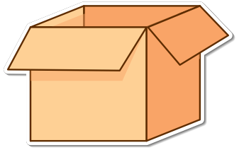

# Timebox 

   

Timebox is a small, opinionated event sourcing library for Go with an append-only event store, optimistic concurrency, and snapshotting. It supports pluggable memory, Redis/Valkey, PostgreSQL, and Raft backends, as well as durable message scheduling.

## Documentation

- [Getting started](https://kode4food.github.io/timebox/docs/getting-started/) — install Timebox and execute a command
- [Order tutorial](https://kode4food.github.io/timebox/docs/tutorial/) — build an application using aggregates and transactions
- [Aggregates and events](https://kode4food.github.io/timebox/docs/aggregates/) — model identities, payloads, and appliers
- [Transactions](https://kode4food.github.io/timebox/docs/transactions/) — commit changes across aggregates
- [Scheduler](https://kode4food.github.io/timebox/docs/scheduler/) — deliver messages at a durable deadline
- [Snapshots, indexing, and archiving](https://kode4food.github.io/timebox/docs/storage/) — manage derived and historical data
- [Backends](https://kode4food.github.io/timebox/docs/backends/) — choose and configure persistence
- [Production patterns](https://kode4food.github.io/timebox/docs/patterns/) — structure a long-running service

The [order example](examples/order.go) shows an aggregate lifecycle using Redis.

## Status

Work in progress. Not ready for production use.
